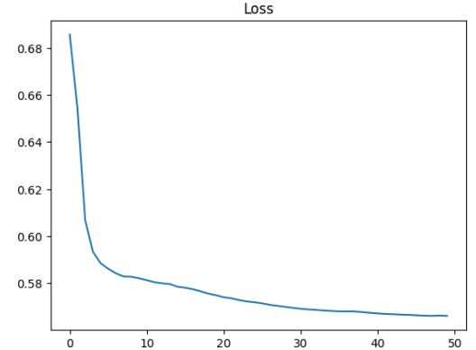
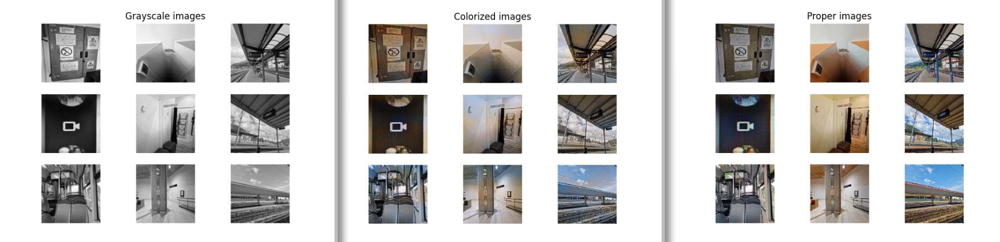
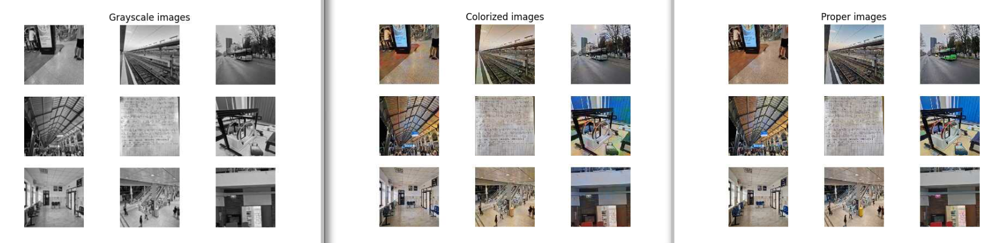

# Image colorization using Keras

I implemented an image colorizer using Keras, with a U-Net neural network architecture, where the input and 2 of the 3 convolutional layers are among the inputs to the transposed convolutional layers, as it can be seen in the below graph.


The input is a 200x200 grayscale image (it gets automatically scaled to 200x200), and the output is a 200x200 RGB image.

## Training the model

```shell
TRAIN_EPOCHS=200 ./train_model.py path/to/the/images/folder model_file.keras
```

The `train_model.py` script trains the model to be used to colorize images.
It needs:
- a folder of color pictures (the first argument) to be used for the training process (a couple hundred should be OK; I used the photos that I made with my phone)
- a file (the second argument, defaults to `model.keras`) to save the model to (if it exists, the training starts with the weights of that file - useful for training the model with different data to prevent overfitting)
- a number of training epochs (defaults to 100), specified using the `TRAIN_EPOCHS` environment variable

The script shows at the end the evolution of the loss and a comparison of the model's predictions for 9 test images.


## Running the model

```shell
./run_model.py grayscale_image.format model_file.keras
```

The `run_model.py` script colorizes a given image using the given (already trained) model and displays it using matplotlib.


```shell
./run.py
```

The `run.py` app is a PyQt5 GUI for working with the model.
You first select the model file, then select the image, then you can compare the grayscale with the colorized version and you can save it if you want (I can confirm the jpg format is working for saving).


## Comparison of various training epochs counts

It's worth noting that an epoch takes about one second on my RTX3060, with 535 images in the data set.

This is how different training epochs fare against each other:

- 200 training epochs


- 100 training epochs


- 50 training epochs





- 30 training epochs




- 200 training epochs, then 50 with a new train-test data split


- 30 training epochs, then 70 with a new train-test data split


## Conclusion

My model can colorize some pictures quite well, but there are some that don't really get colored. A better, more comprehensive dataset might help.

Also, changing the train-test data splits while training the model can be quite helpful.
There aren't any significant benefits from training the model beyond 50 epochs using the same train-test split.

## See also
- [The article from which I got the idea of the neural network's architecture](https://medium.com/@geokam/building-an-image-colorization-neural-network-part-4-implementation-7e8bb74616c) - specifically the 3rd architecture in the article.
